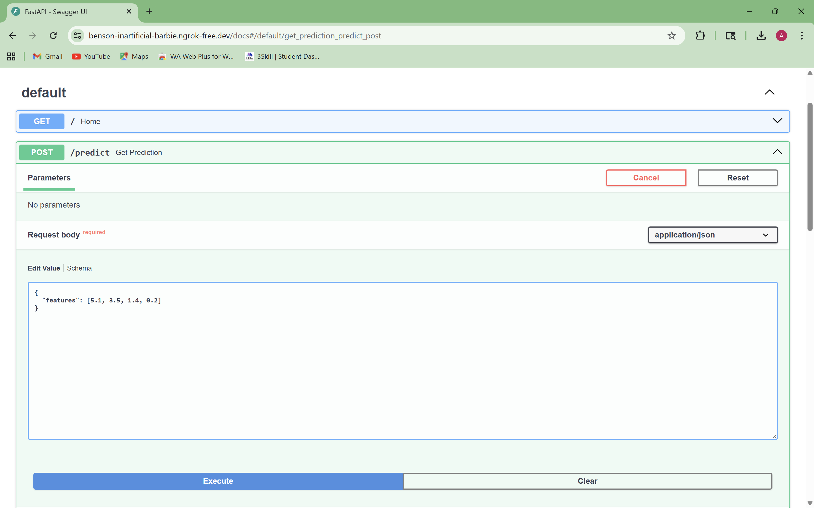
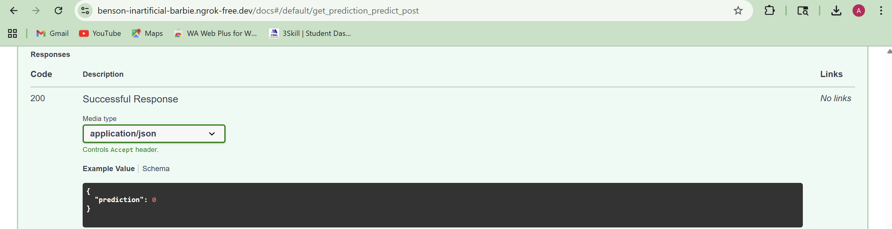

# ML Model API using FastAPI & Docker

## Overview
This project demonstrates how to deploy a trained Machine Learning model as a REST API using FastAPI and Docker. The API accepts input features and returns predictions in real time.

## Features
- FastAPI-based REST API
- Machine Learning model inference
- Docker container support
- Interactive Swagger UI for testing
- Public API access using ngrok

## Installation
1. Clone the repository  
git clone https://github.com/arpita0808/ml-api-fastapi.git  
cd ml-api-fastapi  

2. Install dependencies  
pip install -r requirements.txt  

## Running the API (Locally)
uvicorn app.main:app --reload  

Open in browser: http://127.0.0.1:8000/docs  

## API Endpoints
GET /  
- Home route  

POST /predict  
- Input: JSON features  
- Output: Prediction result  

## Sample Request
{
  "features": [5.1, 3.5, 1.4, 0.2]
}

## Sample Response
{
  "prediction": 0
}

## Docker Setup
Build Docker Image  
docker build -t ml-api .  

Run Docker Container  
docker run -p 8000:8000 ml-api  

## Tech Stack
- Python  
- FastAPI  
- Scikit-learn  
- Docker  
- Uvicorn  

## Demo
Swagger UI  

Prediction Output  

